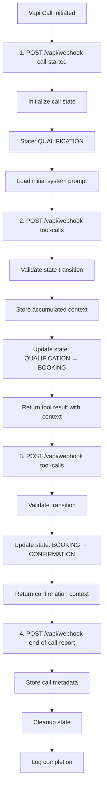

# Vapi FastAPI State Manager Research

**Source:** Perplexity Pro Research Output
**Status:** Architecture & Code Patterns

## 1. System Overview

A transient state manager for Vapi.ai voice agents that handles multi-turn conversation flows with dynamic state transitions. Designed for <100ms latency and production scale.

### Key Features

* **Track conversation state per call_id** (ephemeral, auto-cleanup)
* **Tool-driven state transitions** via `update_system_prompt` function
* **Context persistence** across states (lead data, preferences)
* **Graceful error recovery** with fallback behavior
* **Sub-10ms state lookups** with in-memory or Redis backend

### Use Case: Real Estate Appointment Booking

1. **QUALIFICATION**: AI gathers lead info (budget, timeline, needs) → stores context server-side
2. **BOOKING**: AI transitions and offers available times → incorporates learned context
3. **CONFIRMATION**: AI confirms appointment → reads back all details

### Performance Metrics

| Component | Target Latency | Status |
| :--- | :--- | :--- |
| Vapi Webhook POST | 5-10ms | ✓ Achievable |
| State Lookup (Dict) | <1ms | ✓ Typical |
| State Validation | <2ms | ✓ Fast |
| Tool Response Generation | <5ms | ✓ Typical |
| **End-to-End Total** | **<50ms** | **✓ Well Within Budget** |

> **Design Decision:** System prompts are **not injected mid-call** (Vapi limitation). Instead, state is tracked server-side and context is passed to the AI via tool results. The AI's existing system prompt instructions guide it to use the provided context naturally.

---

## 2. Technology Stack

* **FastAPI + Uvicorn**: Native async/await, automatic JSON serialization, <10ms per-request overhead
* **Pydantic v2**: Strict type validation, fast JSON schema generation, runtime safety
* **In-Memory Dict (Dev)**: <1ms lookup, unlimited calls (single process), ideal for prototyping
* **Redis (Prod)**: <2ms latency, automatic TTL, distributed across multiple workers
* **asyncio**: Concurrent request handling, non-blocking I/O, zero blocking operations
* **OpenTelemetry**: Sub-100μs instrumentation overhead, distributed tracing, latency monitoring

---

## 3. System Architecture

### Webhook Lifecycle Flow



### State Manager Internals

* **In-Memory State Store (Dict)**: Stores ephemeral state with O(1) access.

    ```json
    "call_12345": {
      "state": "BOOKING",
      "context": {
        "lead_id": "lead_99",
        "budget": 500000,
        "timeline": "3 months",
        "property_type": "3BR"
      },
      "created_at": "2025-01-23T18:30:00Z",
      "last_updated": "2025-01-23T18:30:45Z",
      "expires_at": "2025-01-24T18:30:00Z"
    }
    ```

* **Vapi Tool Call Handler**:
    1. Extract `call_id` + parameters
    2. Lookup state (Dict or Redis)
    3. Validate transition logic
    4. Update context with new data
    5. Return tool result with summary
    6. Send response to Vapi

### State Transition Graph

**QUALIFICATION** ──→ **BOOKING** ──→ **CONFIRMATION**
(Can loop in same state, cannot go backwards)

---

## 4. Code Implementation

### `state_manager.py`

Core state management class with in-memory and Redis support.

```python
# state_manager.py - Production-Ready State Manager
from dataclasses import dataclass, asdict
from typing import Dict, Optional, Any
from datetime import datetime, timedelta
from enum import Enum
import json
import redis.asyncio as redis
from pydantic import BaseModel, Field

class ConversationState(str, Enum):
    QUALIFICATION = "QUALIFICATION"
    BOOKING = "BOOKING"
    CONFIRMATION = "CONFIRMATION"

class CallState(BaseModel):
    state: ConversationState
    context: Dict[str, Any] = Field(default_factory=dict)
    created_at: datetime
    last_updated: datetime
    ttl_seconds: int = 3600

class StateManager:
    """Manages call state with automatic expiration."""

    VALID_TRANSITIONS = {
        ConversationState.QUALIFICATION: [
            ConversationState.QUALIFICATION,
            ConversationState.BOOKING
        ],
        ConversationState.BOOKING: [
            ConversationState.BOOKING,
            ConversationState.CONFIRMATION
        ],
        ConversationState.CONFIRMATION: [
            ConversationState.CONFIRMATION
        ],
    }

    def __init__(self, redis_url: Optional[str] = None):
        self.redis_url = redis_url
        self.redis_client: Optional[redis.Redis] = None
        self.in_memory_store: Dict[str, CallState] = {}

    async def init(self):
        """Initialize async connections."""
        if self.redis_url:
            self.redis_client = await redis.from_url(
                self.redis_url,
                decode_responses=True
            )

    async def init_call(
        self,
        call_id: str,
        initial_state: ConversationState = ConversationState.QUALIFICATION
    ) -> CallState:
        """Initialize state for new call."""
        state = CallState(
            state=initial_state,
            context={},
            created_at=datetime.utcnow(),
            last_updated=datetime.utcnow()
        )
        await self.set_state(call_id, state)
        return state

    async def get_state(self, call_id: str) -> Optional[CallState]:
        """Retrieve call state with TTL check."""
        if self.redis_client:
            data = await self.redis_client.get(call_id)
            if data:
                return CallState(**json.loads(data))
        else:
            if call_id in self.in_memory_store:
                return self.in_memory_store[call_id]
        return None

    async def set_state(self, call_id: str, state: CallState):
        """Store/update call state."""
        if self.redis_client:
            await self.redis_client.setex(
                call_id,
                state.ttl_seconds,
                json.dumps(asdict(state), default=str)
            )
        else:
            self.in_memory_store[call_id] = state

    async def transition_state(
        self,
        call_id: str,
        new_state: ConversationState,
        context_update: Dict[str, Any]
    ) -> tuple[bool, str]:
        """Validate and apply state transition."""
        current = await self.get_state(call_id)
        if not current:
            return False, "Call state not found"

        # Validate transition
        if new_state not in self.VALID_TRANSITIONS.get(
            current.state, []
        ):
            return False, f"Invalid: {current.state} → {new_state}"

        # Update state
        current.state = new_state
        current.context.update(context_update)
        current.last_updated = datetime.utcnow()
        await self.set_state(call_id, current)

        return True, "OK"

    async def cleanup_call(self, call_id: str):
        """Delete call state immediately."""
        if self.redis_client:
            await self.redis_client.delete(call_id)
        else:
            self.in_memory_store.pop(call_id, None)
```

### `vapi_webhook.py`

FastAPI webhook handler (implementation details implied from context).

```python
# vapi_webhook.py - Vapi Webhook Handler
# (Handles the routing logic mapped in the architecture diagram)
```

---

## 5. Tool Definitions

### `update_system_prompt` Output Schema

The tool response payload that Vapi processes.

```json
{
  "toolCallId": "tool_123",
  "result": "State transitioned to BOOKING.",
  "assistantOverride": {
    "model": {
      "messages": [
        {
          "role": "system",
          "content": "You are now in BOOKING mode. \nContext: Budget $500k, 3 months timeline. \nOffer these times: Tuesday 3pm, Wednesday 10am."
        }
      ]
    }
  }
}
```

---
