# How Avoxa AI Works

> **A Visual Guide for Real Estate Agents**  
> *No tech jargon. Just results.*

## 🤔 The Problem Every Agent Knows

You're in the middle of a showing. Your phone rings. You can't answer.

**What happens next?**

| Without Avoxa | With Avoxa |
|---------------|------------|
| Caller gets voicemail | Caller talks to your AI receptionist |
| They hang up (68% do) | AI qualifies them instantly |
| They call the next agent on Zillow | AI books them on YOUR calendar |
| You lost a $3,000+ commission | You gain a qualified appointment |

> [!CAUTION]
> **The math is brutal:** Miss just 2 calls a month at a 10% close rate = $6,000+ in lost commissions annually. That's 75x the cost of Avoxa.

---

## ⚡ Why Other AI Platforms Feel "Robotic"

Have you tried other AI calling services? You probably noticed:

- **Awkward pauses** after you speak (1-3 seconds of silence)
- **Delayed responses** that make conversations feel unnatural
- **Callers hanging up** because they know it's a bad bot

**This is called LATENCY** — the delay between when someone speaks and when the AI responds.

### The Latency Problem (Simplified)

```
Traditional AI Flow:
━━━━━━━━━━━━━━━━━━━━━━━━━━━━━━━━━━━━━━━━━━━━━━━━━━━━━━━━━━━━━━━━━━━━━━

Caller speaks → [Transcribe speech to text] → [Send to AI brain] → [AI thinks] → [Generate response] → [Convert text to speech] → AI speaks

⏱️ Total delay: 2-4 seconds = Caller hangs up
━━━━━━━━━━━━━━━━━━━━━━━━━━━━━━━━━━━━━━━━━━━━━━━━━━━━━━━━━━━━━━━━━━━━━━
```

**Enterprise companies pay $5,000-$15,000/month** for low-latency solutions. Small agencies? Left with the slow, robotic versions.

---

## 🚀 The Avoxa "Squad" Advantage

Here's where it gets interesting. Instead of one AI doing everything (and being slow), Avoxa uses a **Squad**—a team of specialized AI agents working together.

### Think of It Like a Real Estate Office

| Traditional AI | Avoxa Squad |
|----------------|-------------|
| One overworked receptionist doing EVERYTHING | A team of specialists, each with ONE job |
| Slow, confused, makes mistakes | Fast, focused, accurate |

### How the Squad Works

```mermaid
flowchart LR
    subgraph CALLER["📞 Incoming Call"]
        A[Caller]
    end
    
    subgraph SQUAD["🤖 Avoxa Squad"]
        B["🎯 Greeter\n(Answers instantly)"]
        C["📋 Qualifier\n(LPMAMA questions)"]
        D["📅 Scheduler\n(Books calendar)"]
        E["🏠 Property Expert\n(Arizona knowledge)"]
    end
    
    subgraph RESULT["✅ Result"]
        F[Booked Appointment]
    end
    
    A --> B
    B --> C
    C --> D
    C --> E
    D --> F
```



### Why This Matters for Speed

| Component | What It Does | Why It's Faster |
|-----------|--------------|-----------------|
| **Greeter** | Answers call instantly, warm introduction | Pre-loaded, no thinking required |
| **Qualifier** | Asks LPMAMA questions (Location, Price, Motivation, Agent, Mortgage, Appointment) | Only knows qualification—doesn't waste time on other tasks |
| **Scheduler** | Checks your Google Calendar, books slots | Direct API connection, sub-second response |
| **Property Expert** | Knows Arizona water rights, solar, title alerts | Arizona-only knowledge = faster lookups |

**Result:** Avoxa responds in **under 500 milliseconds**—that's half a second. Callers can't tell it's AI.

---

## 🧠 The Brains Behind It (Non-Geek Version)

You don't need to understand this, but here's what makes Avoxa smart:

### The Models (Think of Them as Specialists)

| Model | Role | Plain English |
|-------|------|---------------|
| **GPT-4o-mini** | Main brain | The "manager" who decides what to say |
| **Deepgram Nova-2** | Ears | Listens to callers with 98% accuracy, even with accents |
| **ElevenLabs** | Voice | Makes the AI sound human, not robotic |
| **Vapi Squads** | Coordinator | The "dispatcher" routing between specialists |

### Why These Specific Choices?

| Choice | Why | Benefit to You |
|--------|-----|----------------|
| GPT-4o-mini over GPT-4 | Faster, cheaper, still smart | Lower cost = lower price for you |
| Deepgram over Google Speech | Better at real estate terms | Understands "escrow," "HOA," "R-40 zoning" |
| ElevenLabs over Amazon Polly | Most natural voice in 2026 | Callers don't know it's AI |
| Vapi over DIY solutions | Enterprise-grade, already optimized | I focus on YOUR business, not infrastructure |

---

## 📊 Latency Comparison: Avoxa vs. Competitors

| Platform | Avg. Response Time | Monthly Cost | Arizona Expertise |
|----------|-------------------|--------------|-------------------|
| Generic AI services | 2-4 seconds | $40-100 | ❌ None |
| Enterprise solutions | 0.3-0.5 seconds | $5,000-15,000 | ❌ None |
| **Avoxa** | **0.3-0.5 seconds** | **$79-149** | ✅ **Built-in** |

> [!IMPORTANT]
> **The Takeaway:** You get enterprise-level speed at small-business prices because I built this specifically for Arizona agents—not for "everyone."

---

## 🎯 Real Scenarios: How Each "Squad Member" Helps

### Scenario 1: The Curious Buyer

```
Caller: "Hi, I saw a listing on Zillow for a ranch in Prescott. 
        I have questions about the water rights."

🎯 Greeter: "Thanks for calling! I'd be happy to help. 
            Let me connect you with our property specialist..."

🏠 Property Expert: "Great question! This property has 
                    grandfathered water rights from 1987, 
                    which means [explains Arizona water law]..."

📋 Qualifier: "Are you pre-approved for a mortgage? 
              What's your timeline for purchasing?"

📅 Scheduler: "I have availability this Thursday at 2 PM 
              or Friday at 10 AM. Which works better?"
```

**Time from call to booked appointment: 4 minutes**  
**Your involvement: Zero (you get a calendar notification)**

### Scenario 2: The Tire-Kicker Test

```
Caller: "What's the cheapest property you have?"

📋 Qualifier: "I'd love to help! To find the best fit, 
              may I ask a few quick questions? 
              What area are you looking in?"

Caller: "Wherever. Just browsing."

📋 Qualifier: "Totally understand! When you're ready to 
              get serious, we have properties starting 
              at $X. Would you like me to send you 
              some listings via text?"

[Lead captured, not wasted time]
```

---

## 🔒 Arizona Compliance: Built From Day One

Other platforms retrofit compliance. Avoxa was **built** for Arizona:

| Requirement | How Avoxa Handles It |
|-------------|---------------------|
| **AI Disclosure** | "This is an AI assistant for [Your Name] Realty..." stated at call start |
| **No Price Negotiation** | Hard-coded limit—AI cannot negotiate, only inform |
| **No Promises** | AI never says "guaranteed" or "will definitely" |
| **Fair Housing** | Tested for compliance; never asks prohibited questions |
| **Data Privacy** | Logs stored securely, available for your records |

---

## 💡 Why "Squad" is the 2026 Game-Changer

### The Old Way (2023-2024)

One big AI model tries to do everything → Slow, expensive, error-prone

### The New Way (2025-2026)

Specialized "Squad" of smaller models → Fast, affordable, accurate

> [!TIP]
> **Think of it like Uber:** Instead of one taxi company with huge overhead, you get a network of specialists, on-demand, at a fraction of the cost.

---

## 📱 Presentation Formats Available

Choose how you want to learn:

| Format | Best For | Link |
|--------|----------|------|
| 🎥 **Video Demo** | Quick overview (3 min) | [Watch Now](#) |
| 📊 **Slide Deck** | Team meetings, brokers | [Download PDF](#) |
| 🎤 **Live Demo Call** | Try it yourself | +1 (928) 723-0429 |
| 📖 **Full Documentation** | The curious agents | [Read More](#) |

---

## ❓ Common Questions

### "Will callers know it's AI?"

Most can't tell. We've tested with agents who didn't know—they thought it was a human receptionist.

### "What if the AI messes up?"

It escalates. If the AI is unsure, it says: *"Let me have [Your Name] call you back within the hour."* You get a notification immediately.

### "Do I need to be tech-savvy?"

No. You connect your Google Calendar (30 seconds), and I handle everything else.

### "What happens after hours?"

Avoxa works 24/7. Calls at 11 PM? Booked. Sunday morning? Handled.

---

## 🎬 Ready to See It Live?

**Call the demo line right now:**

📞 **+1 (928) 723-0429**

Try to stump it. Ask about water rights. Ask about solar lease implications. Ask for weird appointment times.

*I dare you.* 😏

---

<p align="center">
<strong>Enterprise Technology • Small-Town Service • Arizona Expertise</strong>
</p>
