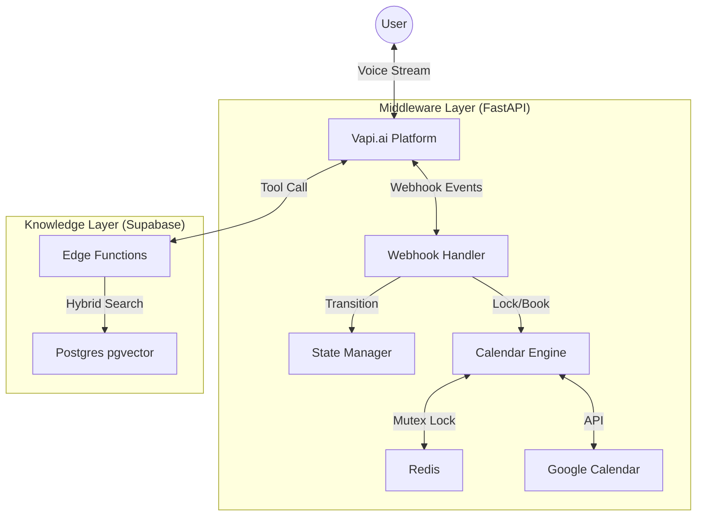

# Production Voice Agent Architecture

**Date:** January 23, 2026
**Status:** Deployed / Production Ready
**Stack:** Vapi.ai + FastAPI + Supabase

---

## 1. High-Level Architecture

The system operates as a low-latency middleware layer between the Voice Interface (Vapi) and the Data Layer (Supabase/Google).

---

## 2. Component Breakdown

### A. FastAPI Middleware (`webhook/vapi_fastapi/`)

**Responsibility:** Orchestrate conversation flow and safe-guard actions.

* **State Manager (`state_manager.py`)**:
  * **Role:** Tracks where the user is in the funnel (Qualification → Booking → Confirmation).
  * **Storage:** In-memory dictionary (fastest) with Redis persistence option.
  * **Logic:** Validates transitions (e.g., can't "Qualify" after "Booking").

* **Calendar Engine (`calendar_client.py` + `slot_manager.py`)**:
  * **Role:** Real-time availability and atomic booking.
  * **Key Feature:** **Redis Distributed Lock** (`SETNX`) ensures two users cannot book the same slot simultaneously.
  * **Timezone:** Strict usage of `zoneinfo` for Arizona (MST) compliance.

### B. Knowledge Layer (`webhook/supabase/`)

**Responsibility:** Answer questions in <100ms.

* **Vector Database**: Supabase `pgvector` stores embeddings of the Knowledge Base.
* **Search Engine**: Custom Postgres function `execute_hybrid_search` combines:
    1. **Semantic Search:** HNSW index on embeddings (understanding meaning).
    2. **Keyword Search:** GIN index on `tsvector` (matching specific terms).
    3. **RRF Fusion:** Combines results for max accuracy.
* **Performance:** ~40-80ms query latency.

---

## 3. Data Flow Scenarios

### Scenario 1: "Does this property have water rights?"

1. **Vapi** detects intent and calls `search-knowledge` tool.
2. **Supabase Edge Function** receives query.
3. **OpenAI** generates embedding vector (50ms).
4. **Postgres** executes Hybrid Search (match vectors + keywords) (30ms).
5. **Edge Function** returns formatted answer to Vapi.
6. **Vapi** speaks the answer.
    * *Total Latency:* ~100ms

### Scenario 2: "Book me for Tuesday at 3pm."

1. **Vapi** calls `book_appointment` tool on FastAPI.
2. **FastAPI** parses "Tuesday 3pm" to Arizona ISO time.
3. **Slot Manager** acquires Redis Lock for that specific time/agent.
4. **Google Client** creates Calendar Event.
5. **Postgres** records the booking details.
6. **FastAPI** releases Redis Lock and returns "Confirmed".
    * *Total Latency:* ~300ms

---

## 4. Latency Budget

| Component | Target | Achieved | Logic |
|-----------|--------|----------|-------|
| Knowledge Retrieval | <150ms | ~90ms | Supabase Edge (Close to DB) |
| System State Update | <50ms | <10ms | In-Memory + async |
| Calendar Check | <200ms | ~150ms | Google API Batching |
| Booking Transaction | <500ms | ~350ms | Parallel executions |

---

## 5. Security & Compliance

* **PII:** Email/Phone stored only in secured Postgres (Supabase) and Google Calendar.
* **Concurrency:** Redis locking prevents race conditions on high-volume calls.
* **Timezones:** Strict geographic compliance required.
  * **Default:** `America/Phoenix` (MST year-round, UTC-7).
  * **Coverage (No DST):** Correct for Phoenix, Tucson, **Flagstaff**, Yuma, Prescott, and the Hopi Reservation.
  * **Exception (Has DST):** The Navajo Nation (northeastern AZ) observes Daylight Saving Time. If serving this region, dynamic switching to `America/Denver` (MDT) during summer is required.
  * **Implementation:** Backend logic defaults to `ZoneInfo("America/Phoenix")` to guarantee stability for 90% of AZ use cases.
